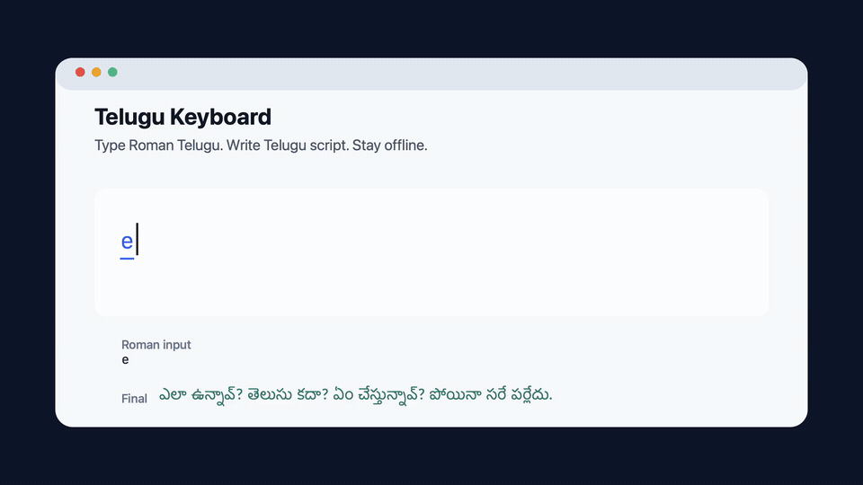

# Telugu Keyboard for macOS

[](https://www.apple.com/macos/)
[](LICENSE)

[](docs/assets/typing-demo.mp4)

Demo sentence: `ela unnav? em chestunnav? bagundi kani ilaa kaadu.` -> `ఎలా ఉన్నావ్? ఏం చేస్తున్నావ్? బాగుంది కానీ ఇలా కాదు.`

Telugu deserves Telugu script.

Many Telugu speakers type Telugu in English letters because laptop keyboards make it feel easier: `telusu`, `bagunnava`, `em chestunnav`. But Roman Telugu is not Telugu writing, and it is not good English either. The English-looking word `telusu` does not naturally carry the sound or dignity of `తెలుసు`; readers have to mentally translate it back into Telugu before it makes sense.

Telugu Keyboard lets you use a simple English keyboard to write Telugu in real Telugu script. Type common Roman Telugu and the keyboard ranks Telugu candidates locally on your Mac:

| Type | Get |
| --- | --- |
| `em chestunnav` | `ఏం చేస్తున్నావ్` |
| `ela unnav` | `ఎలా ఉన్నావ్` |
| `padaku` | `పడకు` |
| `bagundi kani ilaa` | `బాగుంది కానీ ఇలా` |

## Why This Keyboard

| | |
| --- | --- |
| Private by default | The keyboard runs offline. It does not send what you type, candidate selections, or learned words to a server. |
| Built for spoken Telugu | It prioritizes common conversational Telugu, not only strict dictionary-style transliteration. |
| Learns locally | When you explicitly choose a candidate, the keyboard can remember that preference on your Mac. |
| One input source | macOS shows one input source: **Telugu Keyboard**. |
| Open source | Wrong transliterations can be reported, tested, fixed, and reviewed in public. |

## Install

### Signed Installer

The smoothest install path is a signed and notarized Mac package:

1. Download the latest signed `TeluguKeyboard.pkg` from this repository's GitHub Releases page.
2. Open the installer and follow the prompts.
3. When macOS asks whether to allow **Telugu Keyboard**, choose **Allow**.
4. Press the `fn` or globe key to switch input sources and select **Telugu Keyboard**.
5. Type Roman Telugu, press space, and the best Telugu candidate is inserted.

Signed releases are not available yet.

### Homebrew Beta

Until signed releases are available, the project can publish an unsigned Homebrew cask for users who are comfortable pasting one command into Terminal. See [docs/HOMEBREW_INSTALL.md](docs/HOMEBREW_INSTALL.md).

### Developer Install

Developer builds can be installed from Terminal:

```sh
script/install_input_method.sh
```

## Privacy

macOS shows a permission warning for every third-party input source because an input method receives keystrokes while it is active. Telugu Keyboard is designed so those keystrokes stay on your Mac:

- transliteration runs locally;
- runtime typing does not call any network transliteration service;
- learned words are stored locally at `~/Library/Application Support/TeluguKeyboard/learning.json`;
- learning can be disabled, Private Mode can be enabled, and learned words can be cleared.

## Report A Wrong Transliteration

If the keyboard chooses the wrong Telugu word, open a GitHub issue with the **Wrong transliteration** template and include:

- what you typed in Roman letters;
- what the keyboard produced;
- what Telugu output you expected;
- a short sentence if context matters.

Examples are welcome. The project improves by turning real typing corrections into tests.

## Contribute

Before opening a pull request:

```sh
script/ci.sh
```

Every user-confirmed transliteration correction must be recorded in `data/correction_ledger.tsv` and covered by tests. See [CONTRIBUTING.md](CONTRIBUTING.md) and [docs/CORRECTION_PROCESS.md](docs/CORRECTION_PROCESS.md).

## Development

Useful commands:

```sh
swift run telugu-keyboard-cli padaku thondara telugu
swift run telugu-keyboard-smoke-tests
swift run telugu-keyboard-quality-tests
swift script/render_typing_demo.swift
script/test_input_method_e2e.sh
```

The end-to-end script installs the input method, selects it, opens a temporary TextEdit document, verifies real macOS input routing, and closes only its own test document.

## License

MIT. See [LICENSE](LICENSE).
